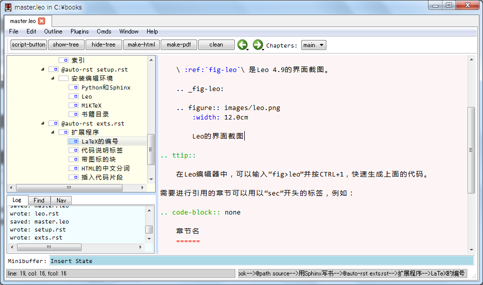

Leo編輯器
============

我們使用Leo編輯器管理和編輯所有的擴展程式和rst檔，\ :ref:`fig-leo`\ 是用Leo 4.9打開“master.leo”時的畫面。

.. _fig-leo:

    Leo的介面截圖

按鈕工具欄
+++++++++++++++

.. _sec-leo-buttons:

打開“master.leo”之後，可以在視窗的上方看到如下圖所示的按鈕工具欄。

.. table:: Leo的按鈕工具欄說明

    ============= ===================================
    按鈕名        功能
    ============= ===================================
    script-button Leo自帶的按鈕，用它可以創建新的按鈕 
    show-tree     顯示並調整提綱視窗的寬度
    hide-tree     隱藏提綱視窗
    make-html     將當前的書籍項目編譯為HTML
    make-pdf      將當前的書籍項目編譯為PDF
    clean         清除當前的書籍專案的編譯結果
    ============= ===================================

其中，make-html、make-pdf以及clean等三個按鈕，需要提綱欄中的當前節點為某個書籍專案的子節點。

快速輸入宏
+++++++++++++++

在“master.leo”中定義了可快速輸入各種命令的巨集，其節點路徑為：

.. code-block:: none

    @chapters-->Scripts-->@command rst-macro
    
輸入宏之後按CTRL+1即可執行，將其擴展為對應的文本。下表列出了一些常用的宏：    
    
.. table:: 快速輸入文本的巨集

    ========   ========================
    輸入       輸出
    ========   ========================
    table      table命令
    inc>       literalinclude命令
    math       math命令
    fig>       figure命令
    _s         章節標籤
    _f         圖表標籤
    sec        章節參照
    fig        圖表參照
    m          行內math命令 
    tl         tlink命令
    tt         ttip命令
    tw         twaring命令
    tc         tcode命令
    ta         tanim命令
    cb         code-block命令
    t          topic命令
    l          超鏈結 
    數字       對應的符號，如❶
    ->         →
    ========   ========================

其中帶“>”的宏可以輸入參數，例如“fig>leo.png”、“inc>example.py>1”等。

